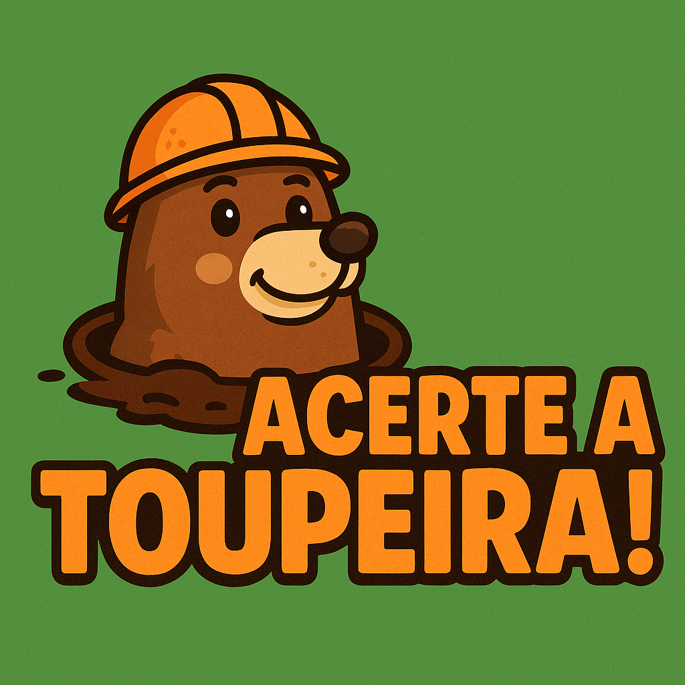

# 🎯 Acerte a Toupeira!

Bem-vindo ao **Acerte a Toupeira!**, um jogo divertido e interativo onde seu objetivo é clicar nas toupeiras antes que elas desapareçam. Teste seus reflexos e veja quantos pontos você consegue em 30 segundos!

<p align="center">
  
</p>


## 🕹️ Como Jogar

1. Clique no botão **"Começar"** na tela inicial.
2. Clique nas toupeiras 🦔 que aparecerem aleatoriamente nos buracos.
3. Cada toupeira acertada vale **1 ponto**.
4. Você tem **30 segundos** para fazer a maior pontuação possível.
5. Clique em **"Reiniciar Jogo"** para tentar novamente.

---

## 📦 Tecnologias Utilizadas

- **HTML5**  
- **CSS3 (com Tailwind CSS)**  
- **JavaScript (puro)**  
- **Google Fonts (Inter)**  
- **Favicon personalizado**

---

## 🎨 Funcionalidades

- Tela inicial animada com botão de início e logotipo
- Animações suaves e responsivas
- Sistema de pontuação e cronômetro
- Tela de fim de jogo com mensagem personalizada

---

## 📁 Estrutura de Pastas
'
├── index.html
├── styles.css
├── script.js
├── img/
│ └── Toupeira-logo.png

---

## 🚀 Como Executar Localmente

1. Clone este repositório:
   ```bash
   git clone https://github.com/seu-usuario/acerte-a-toupeira.git

2. Navegue até o diretório do projeto:

cd acerte-a-toupeira
Abra o arquivo index.html no seu navegador, preferencialmente usando o Live Server do VSCode para melhor experiência.

## 📄 Licença
Este projeto está licenciado sob a MIT License.
Sinta-se à vontade para usar, modificar e compartilhar!
